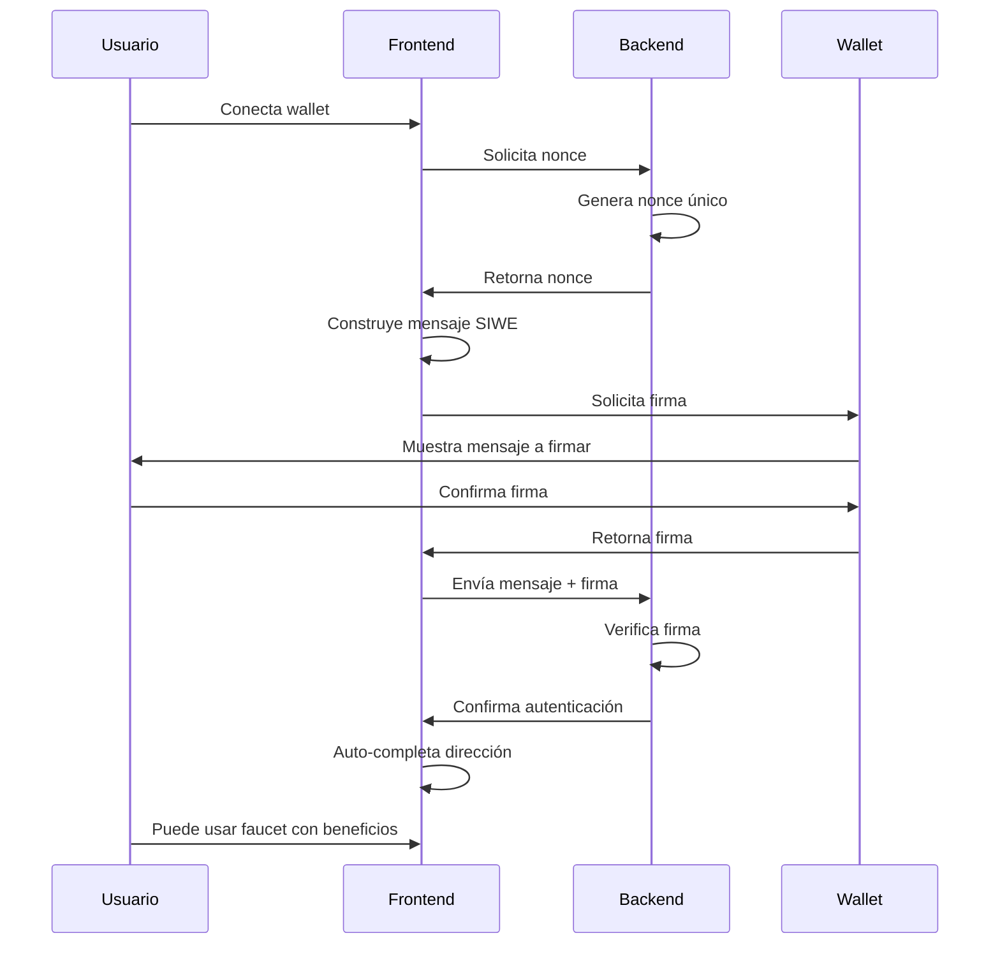

# Módulo SIWE (Sign-In with Ethereum)

## Descripción

El módulo SIWE permite a los usuarios autenticarse mediante la firma de un mensaje con su wallet, siguiendo el estándar EIP-4361. Esta autenticación proporciona beneficios adicionales como factores de recompensa mejorados y acceso a funcionalidades premium del faucet.

## Características

- ✅ Autenticación sin transacciones on-chain
- ✅ Cumple con el estándar EIP-4361
- ✅ Factores de recompensa configurables
- ✅ Restricciones por wallet autenticada
- ✅ Integración con MetaMask y otros wallets
- ✅ Auto-completado de dirección ETH
- ✅ Interfaz de usuario moderna
- ✅ Limpieza automática de nonces expirados

## Configuración

### Configuración Básica

```yaml
modules:
  siwe:
    enabled: true
    
    # Dominio permitido para SIWE (debe coincidir con tu dominio)
    domain: "faucet.example.com"
    
    # URI del faucet
    uri: "https://faucet.example.com"
    
    # Tiempo de expiración del nonce (segundos)
    nonceExpiration: 300  # 5 minutos
    
    # Tiempo de expiración de la sesión SIWE (segundos)
    sessionExpiration: 86400  # 24 horas
    
    # Requerir SIWE para usar el faucet
    required: false
    
    # Factor de recompensa para usuarios autenticados
    rewardFactor: 1.5  # 50% más recompensa
    
    # Restricciones por wallet autenticada
    restrictions:
      - limitCount: 5
        limitAmount: 5000000000000000000  # 5 ETH
        duration: 86400  # 1 día
        message: "Has alcanzado el límite diario para wallets autenticadas"
```

### Parámetros de Configuración

| Parámetro | Tipo | Descripción | Valor por Defecto |
|-----------|------|-------------|-------------------|
| `enabled` | boolean | Habilita/deshabilita el módulo | `false` |
| `domain` | string | Dominio para validación SIWE | **Requerido** |
| `uri` | string | URI completa del faucet | **Requerido** |
| `nonceExpiration` | number | Expiración del nonce en segundos | `300` |
| `sessionExpiration` | number | Expiración de sesión en segundos | `86400` |
| `required` | boolean | Si SIWE es obligatorio | `false` |
| `rewardFactor` | number | Multiplicador de recompensa | `1.0` |
| `restrictions` | array | Lista de restricciones | `[]` |

### Configuración de Restricciones

```yaml
restrictions:
  - limitCount: 10          # Máximo 10 sesiones
    duration: 86400         # En 24 horas
    message: "Límite diario alcanzado"
  
  - limitAmount: 1000000000000000000  # Máximo 1 ETH
    duration: 3600          # En 1 hora
    message: "Límite por hora alcanzado"
```

## Flujo de Autenticación

### 1. Proceso Completo



### 2. Estructura del Mensaje SIWE

```
faucet.example.com wants you to sign in with your Ethereum account:
0x742d35Cc6634C0532925a3b8D4C9db96590c6C87

Sign in to access the faucet with enhanced rewards.

URI: https://faucet.example.com
Version: 1
Chain ID: 11155111
Nonce: a1b2c3d4e5f6789012345678
Issued At: 2026-01-13T10:30:00.000Z
Expiration Time: 2026-01-13T10:35:00.000Z
```

## API Endpoints

### GET /api/siweNonce

Genera un nonce único para la autenticación SIWE.

**Respuesta:**
```json
{
  "nonce": "a1b2c3d4e5f6789012345678",
  "expiresIn": 300
}
```

### POST /api/siweVerify

Verifica la firma SIWE y crea la sesión autenticada.

**Request:**
```json
{
  "message": "faucet.example.com wants you to sign in...",
  "signature": "0x1234567890abcdef..."
}
```

**Respuesta exitosa:**
```json
{
  "success": true,
  "address": "0x742d35Cc6634C0532925a3b8D4C9db96590c6C87",
  "token": "siwe-session-token-123"
}
```

**Respuesta de error:**
```json
{
  "success": false,
  "error": "Invalid signature"
}
```

## Integración Frontend

### Componente React

El módulo incluye un componente React completo para la autenticación:

```typescript
import { SiweLogin } from './components/frontpage/siwe/SiweLogin';

// Uso en tu componente
<SiweLogin 
  onAuthenticated={(address, token) => {
    // Manejar autenticación exitosa
    setAuthenticatedAddress(address);
  }}
  onError={(error) => {
    // Manejar errores
    console.error('SIWE error:', error);
  }}
/>
```

### Integración Manual

```javascript
// 1. Obtener nonce
const nonceResponse = await fetch('/api/siweNonce');
const { nonce } = await nonceResponse.json();

// 2. Construir mensaje SIWE
const message = `${domain} wants you to sign in with your Ethereum account:
${address}

Sign in to access the faucet with enhanced rewards.

URI: ${uri}
Version: 1
Chain ID: ${chainId}
Nonce: ${nonce}
Issued At: ${new Date().toISOString()}
Expiration Time: ${new Date(Date.now() + 300000).toISOString()}`;

// 3. Solicitar firma
const signature = await provider.send('personal_sign', [message, address]);

// 4. Verificar firma
const verifyResponse = await fetch('/api/siweVerify', {
  method: 'POST',
  headers: { 'Content-Type': 'application/json' },
  body: JSON.stringify({ message, signature })
});

const result = await verifyResponse.json();
if (result.success) {
  // Autenticación exitosa
  console.log('Authenticated as:', result.address);
}
```

## Base de Datos

### Tablas Creadas

El módulo crea automáticamente las siguientes tablas:

#### siwe_nonces
```sql
CREATE TABLE siwe_nonces (
  nonce TEXT PRIMARY KEY,
  created_at INTEGER NOT NULL,
  expires_at INTEGER NOT NULL
);
```

#### siwe_sessions
```sql
CREATE TABLE siwe_sessions (
  session_id TEXT PRIMARY KEY,
  siwe_address TEXT NOT NULL,
  created_at INTEGER NOT NULL,
  expires_at INTEGER NOT NULL
);
```

### Limpieza Automática

- Los nonces expirados se eliminan automáticamente cada 5 minutos
- Las sesiones expiradas se limpian cada hora
- No requiere mantenimiento manual

## Beneficios para Usuarios

### Factor de Recompensa

Los usuarios autenticados reciben un multiplicador en sus recompensas:

```yaml
rewardFactor: 1.5  # Usuario recibe 50% más ETH
```

**Ejemplo:**
- Recompensa base: 0.1 ETH
- Con SIWE: 0.15 ETH (50% adicional)

### Auto-completado de Dirección

- La dirección ETH se completa automáticamente después de la autenticación
- El usuario puede cambiarla si desea enviar a otra wallet
- Solo se aplica el bonus si la dirección coincide con la wallet autenticada

### Acceso Prioritario

- Sesiones autenticadas pueden tener prioridad en la cola
- Límites más altos para usuarios verificados
- Acceso a funcionalidades premium (futuras)

## Seguridad

### Validaciones Implementadas

1. **Verificación de Firma**: Usa la librería `siwe` oficial
2. **Validación de Dominio**: Solo acepta firmas para el dominio configurado
3. **Expiración de Nonce**: Nonces válidos por tiempo limitado
4. **Uso Único**: Cada nonce solo puede usarse una vez
5. **Validación de Dirección**: La dirección debe coincidir para aplicar beneficios

### Mejores Prácticas

- Configura `domain` exactamente como tu dominio público
- Usa HTTPS en producción
- Mantén `nonceExpiration` bajo (5-10 minutos)
- Implementa rate limiting en los endpoints
- Monitorea intentos de autenticación fallidos

## Troubleshooting

### Errores Comunes

#### "Invalid or expired nonce"
- **Causa**: Nonce expirado o ya usado
- **Solución**: Generar nuevo nonce

#### "Domain mismatch"
- **Causa**: El dominio en la configuración no coincide con el mensaje
- **Solución**: Verificar configuración de `domain`

#### "Signature verification failed"
- **Causa**: Firma inválida o mensaje modificado
- **Solución**: Verificar que el mensaje se construya correctamente

#### "SIWE_ADDRESS_MISMATCH"
- **Causa**: La dirección autenticada no coincide con la dirección objetivo
- **Solución**: Usar la misma dirección o permitir direcciones diferentes

### Logs de Debug

Habilita logs detallados:

```yaml
faucetLogLevel: "debug"
```

Busca logs con prefijo `[SIWE]` para debugging específico del módulo.

## Métricas y Monitoreo

### Estadísticas Disponibles

El módulo expone las siguientes métricas:

- Número de autenticaciones exitosas
- Número de autenticaciones fallidas
- Nonces generados vs consumidos
- Sesiones SIWE activas
- Factor de recompensa aplicado

### Integración con Prometheus

```yaml
# Métricas exportadas (futuro)
siwe_authentications_total{status="success|failed"}
siwe_nonces_generated_total
siwe_sessions_active
siwe_reward_factor_applied_total
```

## Desarrollo y Testing

### Ejecutar Tests

```bash
# Compilar TypeScript
npx tsc -p tsconfig.test.json

# Copiar archivos necesarios (Windows)
Copy-Item -Recurse libs dist-test/
Copy-Item -Recurse static dist-test/

# Ejecutar tests específicos del módulo SIWE
$env:NODE_OPTIONS='--experimental-vm-modules'
$env:NODE_NO_WARNINGS=1
npx mocha --exit 'dist-test/tests/modules/SiweModule.spec.js'
```

### Tests Incluidos

- ✅ Exportación de configuración del cliente
- ✅ Generación de nonce via API
- ✅ Aplicación de factor de recompensa
- ✅ Validación de SIWE requerido
- ✅ Rechazo por dirección no coincidente
- ✅ Aplicación de restricciones
- ✅ Limpieza de base de datos

## Roadmap

### Próximas Mejoras

- [ ] Soporte para múltiples cadenas
- [ ] Integración con ENS
- [ ] Verificación de balance mínimo
- [ ] Whitelist de direcciones premium
- [ ] Métricas Prometheus nativas
- [ ] Dashboard de administración
- [ ] Notificaciones por email/Discord

### Compatibilidad

- ✅ MetaMask
- ✅ WalletConnect
- ✅ Coinbase Wallet
- ✅ Otros wallets compatibles con EIP-1193

## Soporte

Para reportar bugs o solicitar funcionalidades:

1. Revisa los logs del servidor
2. Verifica la configuración
3. Consulta esta documentación
4. Crea un issue en el repositorio

---

**Versión del módulo**: 1.0.0  
**Última actualización**: Enero 2026  
**Autor**: Luis Corales (basado en PoWFaucet por pk910)